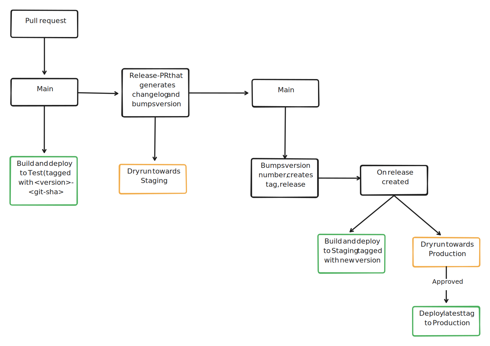

# Deployment process (Automated)

Deployments are done using `Github Actions` with the following steps:

## 1. Create and Merge Pull Request
- **Action**: Create a pull request.
- **Merge**: Once the pull request is reviewed and approved, merge it into the `main` branch.

## 2. Build and Deploy to Test
- **Trigger**: Merging the pull request into `main`.
- **Action**: The code is built and deployed to the test environment.
- **Tag**: The deployment is tagged with `<version>-<git-sha>`.

## 3. Prepare Release for Staging
- **Passive**: Release-please creates or updates a release pull request.
- **Purpose**: This generates a changelog and bumps the version number.
- **Merge**: Merge the release pull request into the `main` branch.

## 4. Deploy to Staging (Bump Version and Create Tag)
- **Trigger**: Merging the release pull request.
- **Action**: 
  - Bumps the version number.
  - Generates the release and changelog.
  - Deployment is tagged with the new `<version>` without `<git-sha>`
  - The new version is built and deployed to the staging environment.

## 5. Prepare deployment to Production
- **Action**: Perform a dry run towards the production environment to ensure the deployment can proceed without issues.

## 6. Deploy to Production
- **Trigger**: Approval of the dry run.
- **Action**: The new version is built and deployed to the production environment.

## Visual Workflow

[Release Please](https://github.com/google-github-actions/release-please-action) is used in order to create releases, generate changelog and bumping version numbers.

`CHANGELOG.md` and `version.txt` are automatically updated and should not be changed manually.
