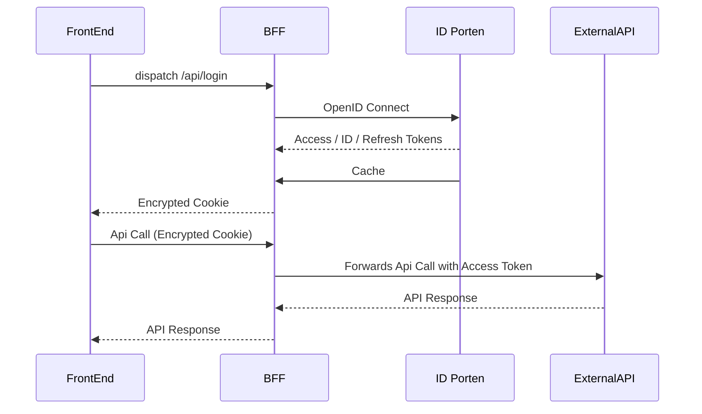

# ID Porten

Our app needs to connect to id-porten

```mermaid
sequenceDiagram
    participant FrontEnd
    participant BFF
    participant IDPorten as ID Porten
    participant ExternalAPI

    FrontEnd->>BFF: dispatch /api/login
    BFF->>IDPorten: OpenID Connect
    IDPorten-->>BFF: Access / ID / Refresh Tokens
    IDPorten->>BFF: Cache
    BFF-->>FrontEnd: Encrypted Cookie
    FrontEnd->>BFF: Api Call (Encrypted Cookie)
    BFF->>ExternalAPI: Forwards Api Call with Access Token
    ExternalAPI-->>BFF: API Response
    BFF-->>FrontEnd: API Response
```
